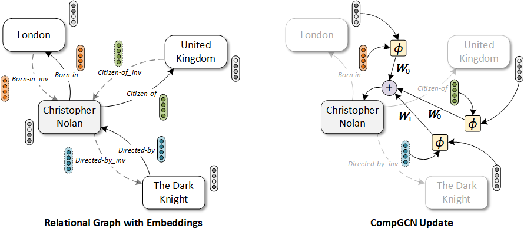

<h1 align="center">
  CompGCN
</h1>

<h4 align="center">Composition-Based Multi-Relational Graph Convolutional Networks</h4>

<p align="center">
  <a href="https://iclr.cc/"></a>
  <a href="https://arxiv.org/abs/1911.03082"></a>
  <a href="https://iclr.cc/virtual/poster_BylA_C4tPr.html"></a>
  <a href="https://medium.com/@mgalkin/knowledge-graphs-iclr-2020-f555c8ef10e3"></a>
  <a href="https://github.com/malllabiisc/CompGCN/blob/master/LICENSE">
    
  </a>
</p>


<h2 align="center">
  Overview of CompGCN
  
</h2>
Given node and relation embeddings, CompGCN performs a composition operation φ(·) over each edge in the neighborhood of a central node (e.g. Christopher Nolan above). The composed embeddings are then convolved with specific filters WO and WI for original and inverse relations respectively. We omit self-loop in the diagram for clarity. The message from all the neighbors are then aggregated to get an updated embedding of the central node. Also, the relation embeddings are transformed using a separate weight matrix. Please refer to the paper for details.

### Dependencies

- Compatible with PyTorch 1.0 and Python 3.x.
- Dependencies can be installed using `requirements.txt`.

### Dataset:

- We use FB15k-237 and WN18RR dataset for knowledge graph link prediction. 
- FB15k-237 and WN18RR are included in the `data` directory. 

### Training model:

- Install all the requirements from `requirements.txt.`

- Execute `./setup.sh` for extracting the dataset and setting up the folder hierarchy for experiments.

- Commands for reproducing the reported results on link prediction:

  ```shell
  ##### with TransE Score Function
  # CompGCN (Composition: Subtraction)
  python run.py -score_func transe -opn sub -gamma 9 -hid_drop 0.1 -init_dim 200
  
  # CompGCN (Composition: Multiplication)
  python run.py -score_func transe -opn mult -gamma 9 -hid_drop 0.2 -init_dim 200
  
  # CompGCN (Composition: Circular Correlation)
  python run.py -score_func transe -opn corr -gamma 40 -hid_drop 0.1 -init_dim 200
  
  ##### with DistMult Score Function
  # CompGCN (Composition: Subtraction)
  python run.py -score_func distmult -opn sub -gcn_dim 150 -gcn_layer 2 
  
  # CompGCN (Composition: Multiplication)
  python run.py -score_func distmult -opn mult -gcn_dim 150 -gcn_layer 2 
  
  # CompGCN (Composition: Circular Correlation)
  python run.py -score_func distmult -opn corr -gcn_dim 150 -gcn_layer 2 
  
  ##### with ConvE Score Function
  # CompGCN (Composition: Subtraction)
  python run.py -score_func conve -opn sub -ker_sz 5
  
  # CompGCN (Composition: Multiplication)
  python run.py -score_func conve -opn mult
  
  # CompGCN (Composition: Circular Correlation)
  python run.py -score_func conve -opn corr
  
  ##### Overall BEST:
  python run.py -name best_model -score_func conve -opn corr 
  ```

  - `-score_func` denotes the link prediction score score function 
  - `-opn` is the composition operation used in **CompGCN**. It can take the following values:
    - `sub` for subtraction operation:  Φ(e_s, e_r) = e_s - e_r
    - `mult` for multiplication operation:  Φ(e_s, e_r) = e_s * e_r
    - `corr` for circular-correlation: Φ(e_s, e_r) = e_s ★ e_r
  - `-name` is some name given for the run (used for storing model parameters)
  - `-model` is name of the model `compgcn'.
  - `-gpu` for specifying the GPU to use
  - Rest of the arguments can be listed using `python run.py -h`
### Citation:
Please cite the following paper if you use this code in your work.
```bibtex
@inproceedings{
    vashishth2020compositionbased,
    title={Composition-based Multi-Relational Graph Convolutional Networks},
    author={Shikhar Vashishth and Soumya Sanyal and Vikram Nitin and Partha Talukdar},
    booktitle={International Conference on Learning Representations},
    year={2020},
    url={https://openreview.net/forum?id=BylA_C4tPr}
}
```
For any clarification, comments, or suggestions please create an issue or contact [Shikhar](http://shikhar-vashishth.github.io).
